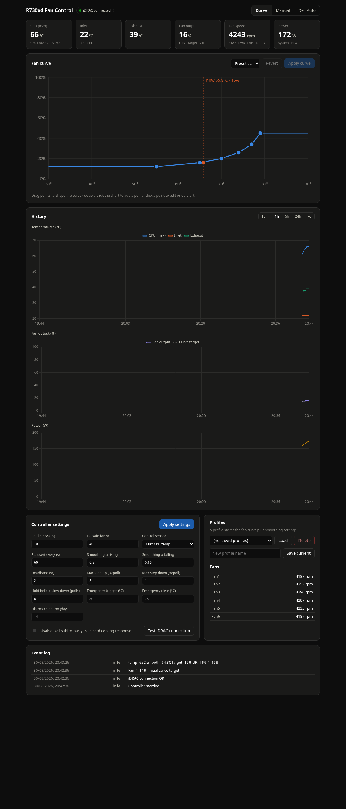
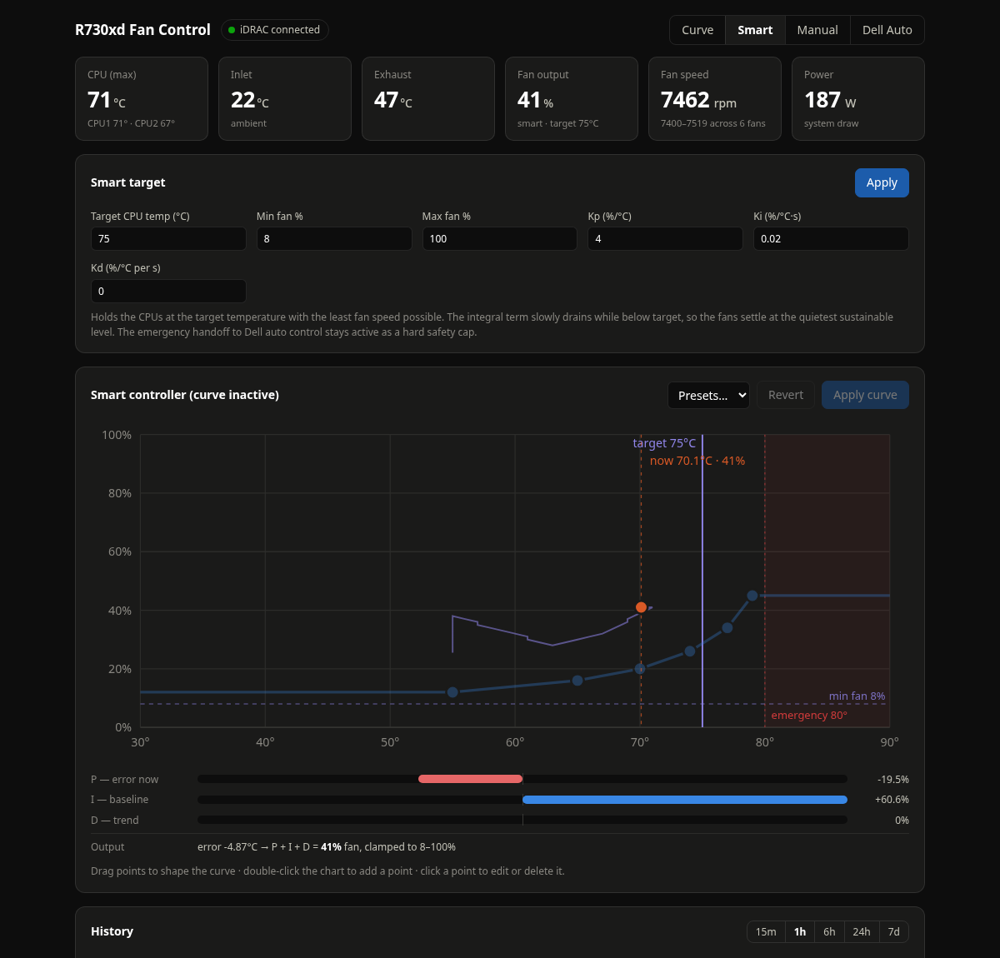

# R730xd Fan Control

Web-controllable fan control for a Dell PowerEdge R730xd, packaged as a single
Docker container. Replaces the old root-host `r730xd-fan-control.sh` systemd
service: because it talks to the iDRAC over the network (IPMI-over-LAN /
`lanplus`), it can run anywhere on the LAN — including a Docker VM managed by
Portainer — instead of on the Proxmox host itself.




## Features

- **Web UI** (LAN-only, no auth): live temps, per-fan RPM, fan output %, power draw.
- **Fan curve editor**: drag points, double-click to add, per-point numeric edit,
  Silent / Balanced / Cool presets.
- **Four modes**: Curve, **Smart (PID)** — hold a target CPU temperature with the
  minimum fan speed (the integral term drains while below target, so the fans
  settle at the quietest sustainable level), Manual (fixed %), Dell Auto.
- **The original quiet-first algorithm**, ported intact:
  - control temp = max(CPU1, CPU2) (or avg CPU / max of all sensors),
  - asymmetric EMA smoothing — rises track fast, falls track slow,
  - deadband + slew limiting (fast up, 1 %/poll silent decay after a hold period),
  - **emergency handoff to Dell auto on the RAW temperature** — smoothing can
    never delay the safety response.
- **Safety additions**:
  - repeated sensor-read failures hand the fans back to Dell auto (not stuck at failsafe),
  - the fan command is periodically re-asserted in case the iDRAC resets,
  - clean shutdown restores Dell automatic control,
  - all tunables are validated server-side before they're accepted.
- **History**: SQLite-backed charts (15 m – 7 d) for temps, fan output vs curve
  target, and power; configurable retention.
- **Profiles**: save/load named curve+smoothing sets.
- **Third-party PCIe cooling response toggle** (the Dell "ramp fans because of an
  unknown PCIe card" behavior).
- **Drive temperature monitoring** (display-only, never drives control): per-drive
  grid with a configurable warning setpoint and a "hottest drive" history chart.
  Requires the host exporter with `smartmontools` installed on the Proxmox host.
- **Event log** of every controller decision.

## Prerequisites — one-time iDRAC setup

Enable IPMI over LAN on the iDRAC (off by default):

- Web UI: *iDRAC Settings → Network → IPMI Settings → Enable IPMI over LAN*, or
- from the Proxmox host: `ipmitool lan set 1 access on`

The container only needs to reach the iDRAC's IP on UDP 623.

## Optional: fast host temperature source

Proxmox cannot expose host sensors to a VM natively, and every iDRAC lanplus
call costs 0.5–2s. For a genuinely fast control loop (2–5s polls), run the
tiny exporter in `host-exporter/` on the Proxmox host — it serves the real
coretemp package temps over HTTP in ~5ms:

```sh
cp host-exporter/temp-exporter.py /usr/local/bin/ && chmod +x /usr/local/bin/temp-exporter.py
cp host-exporter/temp-exporter.service /etc/systemd/system/
systemctl enable --now temp-exporter
curl http://localhost:9333/   # sanity check
```

Then in the web UI enable *Use host temp exporter* and set the URL
(`http://<proxmox-ip>:9333/`). The controller prefers the exporter and
**falls back to the iDRAC automatically** if it stops responding, so safety
never depends on it. With the exporter active, the iDRAC is only used for
fan commands plus fans/power/ambient telemetry (throttled to one read per
10s regardless of poll interval).

Note: DTS package temps read ~3–8°C higher than the iDRAC socket sensors —
nudge your Smart target / curve up accordingly after switching.

## Deploy with Portainer

**Option A — build from this repository (recommended).** Push this directory to
a Git repo, then in Portainer: *Stacks → Add stack → Repository*, point it at
the repo (compose path `docker-compose.yml`), and add environment variables:

| Variable | Value |
|---|---|
| `IDRAC_HOST` | your iDRAC IP, e.g. `192.168.1.120` |
| `IDRAC_USER` | iDRAC user (default `root`) |
| `IDRAC_PASSWORD` | iDRAC password |

**Option B — build the image on the VM first:**

```sh
docker build -t r730xd-fan-control:latest .
```

then create a Portainer stack from `docker-compose.yml` (*Web editor*), remove
the `build: .` line, and set the same environment variables.

Open **http://\<vm-ip\>:8730** when the stack is up.

To preview the UI without touching hardware, set `MOCK_IPMI=true`.

## Configuration

Everything is configurable in the UI and persisted to the `fan-data` volume
(`/data/config.json`, plus `/data/history.db`). Environment variables:

| Variable | Default | Meaning |
|---|---|---|
| `IDRAC_HOST` | — | iDRAC IP/hostname (required for lanplus) |
| `IDRAC_USER` | `root` | iDRAC username |
| `IDRAC_PASSWORD` | `calvin` | iDRAC password |
| `IDRAC_PASSWORD_FILE` | — | read the password from a file/secret instead |
| `IPMI_INTERFACE` | `lanplus` | set `open` + map `/dev/ipmi0` for local IPMI |
| `MOCK_IPMI` | `false` | simulated server for UI preview/testing |

## Safety notes

- If the **container dies hard** (VM crash, docker kill), the iDRAC keeps the
  last manual fan setting — same caveat as the original script. `restart:
  unless-stopped` plus the container healthcheck restart it; a normal stop or
  restart always restores Dell auto control first.
- The emergency trigger/clear temperatures and the failsafe percentage are
  editable in *Controller settings*; emergencies always evaluate the raw CPU
  temperature, never the smoothed value.

## Retiring the old service

On the Proxmox host, once the stack is running:

```sh
systemctl disable --now r730xd-fan-control.service
```

(The service's stop handler restores Dell auto control; the container takes
over on its next poll.)
